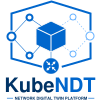
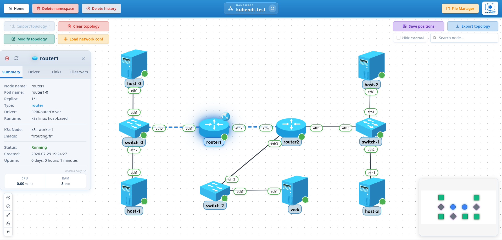

# KubeNDT

<p align="center">
   
</p>

<p align="center">
   <a href="https://doi.org/10.5281/zenodo.21276320"></a>
</p>

> Last reviewed: 29 Jul 2026

**KubeNDT** is a platform for deploying and operating virtual network topologies on Kubernetes.

You define your topology as a JSON file  (nodes, links, images, replicas) and KubeNDT deploys it into your cluster and shows it as a live graph in the dashboard. From there you can apply a network configuration (IP addresses, routes, NAT, OSPF, bridging…) across all nodes at once, open a shell into any of them, add or remove nodes on the fly, and monitor interface states in real time. Any container image works as a node. 

Network configuration is abstracted through a **driver and capability system**: regardless of what image a node runs, the same declarative actions apply. The driver takes care of translating them into the right commands for that node type.



## License

Copyright (C) 2026 Emilio García de la Calera Molina

**KubeNDT** is licensed under the GNU Affero General Public License v3.0 only (AGPL-3.0-only).

You may use, modify, and distribute this software under the terms of the AGPL-3.0-only license.

Commercial licensing may be available in the future.

For inquiries, contact: er.garciadelacalera@gmail.com

See the LICENSE file for full details.

### Third-party assets

KubeNDT bundles a small set of third-party SVG icons in its frontend.
See [ATTRIBUTION.md](./ATTRIBUTION.md) for the full list of authors,
collections and licenses (CC BY 4.0, OFL).

## Key Features

### Core Capabilities

- **Real-time topology visualization** using React Flow with drag-and-drop node positioning
- **Multi-instance nodes** via StatefulSets with configurable replicas (e.g., 3 routers running simultaneously)
- **Virtual networking overlays** powered by Meshnet CNI for custom L2/L3 connectivity
- **Meshnet health awareness** - the dashboard shows whether the Meshnet dataplane is running (per cluster and per node), and blocks a deploy when it is missing so topologies don't come up with unwired links
- **Modular driver architecture** supporting different node types (hosts, routers, switches) with extensible capabilities
- **Interactive terminal shell** with WebSocket for real-time pod access
- **Dynamic network modification** - add/delete nodes and links without redeploying the entire topology
- **Configuration management** - mount configuration files, environment variables, and dynamic daemon setup
- **Persistent topology state** - save/export topologies as JSON for reproducible deployments

### Advanced Networking Features

- **Layer 2 operations**: Interface management, bridge creation, VLAN configuration
- **Layer 3 operations**: IP address assignment, static routing, default gateway configuration
- **Routing protocols**: FRRouting (OSPF, BGP, ISIS, etc.) integration for dynamic routing
- **Traffic control (QoS)**: Rate limiting, traffic shaping, netem (network emulation)
- **NAT/Port forwarding**: Source NAT (SNAT) and Destination NAT (DNAT) configurations
- **Network diagnostics**: Real-time interface status, IP address tracking, traffic analysis
- **Live packet capture**: Wireshark-like per-interface capture streamed to the dashboard, with `.pcap` export
- **Packet-path visualization**: run a traceroute from any node and watch the packet hop across the graph, with tunnel and drop/delivery detection and optional per-hop latency stats. Also available as a REST endpoint

### Enterprise Features

- **Multi-namespace support** - isolate topologies per namespace
- **Authentication** - password login, browser sessions and revocable API tokens
- **Horizontal scaling** - support for large clusters with many pods
- **Prometheus-compatible** - database-backed state for monitoring integration
- **RESTful API** - Swagger-documented API for programmatic topology management
- **File management** - upload, organize, and mount configuration files into pods

---

## Quick Start

### Requirements

- **Kubernetes 1.20+** with **Meshnet CNI** plugin installed. You can follow the [Kubernetes Installation Guide](doc/How-to-deploy-a-K8s-cluster.md) for more information.
- A valid kubeconfig with cluster context
- Docker & Docker Compose (for production deployment)
- Optional: QEMU support for VM-based node types (requires `/dev/kvm`)

**For local development, also install:**
- Go 1.26+ with CGO enabled (requires `gcc` and `libsqlite3-dev`)
- Node.js 24 LTS

For troubleshooting steps, see [doc/TROUBLESHOOTING.md](doc/TROUBLESHOOTING.md).

### Run with Docker Compose

This is how you deploy and use KubeNDT. It runs as two containers: the `backend`
(Go API) and the `frontend` (the React dashboard served by nginx, which also
reverse-proxies `/api` to the backend). Make sure your kubeconfig is at
`~/.kube/config`; it is mounted read-only into the backend.

**Published images** (nothing to compile). Grab the compose file and run:
```bash
curl -O https://raw.githubusercontent.com/emigcm98/kubendt/main/docker-compose.prod.yml
docker compose -f docker-compose.prod.yml up -d
```
Pin a release with `KUBENDT_TAG=1.0.0` (defaults to `latest`). Image tags are
plain semver without the leading `v`. Published images are available from the
first release onward.

**Build from source** instead:
```bash
git clone https://github.com/emigcm98/kubendt.git
cd kubendt
docker compose up --build
```

Either way, open http://localhost in your browser.

**Authentication:** the dashboard and API require login. The provided compose
files ship a default password **`admin123`**, change it via `KUBENDT_ADMIN_PASSWORD`
before any real use. If you unset it entirely, a random password is generated
and printed once in the backend logs. For programmatic access, create an API
token in the dashboard and send it as `Authorization: Bearer <token>`. See
[doc/DEPLOYMENT.md](doc/DEPLOYMENT.md#authentication) for all auth variables.

**Common settings** (in the compose file's `environment:`, or via your shell):

- `KUBENDT_ADMIN_PASSWORD`: admin login password (default `admin123`).
- `KUBENDT_TAG`: published image tag to run, e.g. `1.0.0` (default `latest`).
- `KUBENDT_AUTH_DISABLED=true`: run without authentication (trusted networks only).
- `KUBENDT_COOKIE_SECURE=true`: set when serving over HTTPS.
- Host port: change the `"80:8080"` mapping if port 80 is already in use.

Full reference in [doc/DEPLOYMENT.md](doc/DEPLOYMENT.md#environment-variables-reference).

### Local Development (without Docker)

For contributing or hacking on KubeNDT, run the two processes directly in two
terminals. Clone the repo first:
```bash
git clone https://github.com/emigcm98/kubendt.git
cd kubendt
```

**Backend:**
```bash
cd backend
go run .
```
Runs on http://localhost:8080.

**Frontend** (new terminal):
```bash
cd frontend
npm ci
npm start
```
Runs on http://localhost:3000.

See [CONTRIBUTING.md](CONTRIBUTING.md) for the full list of required tools and versions.

---

## Technical Documentation

The full technical details were moved out of this top-level README to keep first-time onboarding concise.

- Architecture and execution model: [doc/ARCHITECTURE.md](doc/ARCHITECTURE.md)
- Deployment modes and environment variables: [doc/DEPLOYMENT.md](doc/DEPLOYMENT.md)
- Troubleshooting: [doc/TROUBLESHOOTING.md](doc/TROUBLESHOOTING.md)
- Deep implementation notes: [doc/IMPLEMENTATION_DETAILS.md](doc/IMPLEMENTATION_DETAILS.md)
- Implementation summary: [doc/IMPLEMENTATION_SUMMARY.md](doc/IMPLEMENTATION_SUMMARY.md)
- Architecture flows and diagrams: [doc/ARCHITECTURE_FLOWS.md](doc/ARCHITECTURE_FLOWS.md)


## Use Cases & Examples

KubeNDT includes **6 reference deployments** in `deploy/examples/`. Start with the scenario that matches your use case:

| Example | Guide | Description | Complexity |
|---------|-------------|----------|----------|
| [1-test-small](deploy/examples/1-test-small/) | [1-README](deploy/examples/1-test-small/README.md) | Basic topology with hosts, switches, and routing | ⭐ |
| [2-test-frr-ospf](deploy/examples/2-test-frr-ospf/) | [2-README](deploy/examples/2-test-frr-ospf/README.md) | FRRouting with OSPF dynamic routing | ⭐⭐ |
| [3-test-modify-ospf](deploy/examples/3-test-modify-ospf/) | [3-README](deploy/examples/3-test-modify-ospf/README.md) | Full dynamic-modification lifecycle on a routed OSPF topology with FRR and VyOS (scale, add, delete, replay) | ⭐⭐⭐⭐ |
| [4-test-medium-allfeatures](deploy/examples/4-test-medium-allfeatures/) | [4-README](deploy/examples/4-test-medium-allfeatures/README.md) | All features combined (NAT, TC, bridges, routing) | ⭐⭐⭐ |
| [5-test-full-open5gs](deploy/examples/5-test-full-open5gs/) | [5-README](deploy/examples/5-test-full-open5gs/README.md) | 5G core network with Open5GS | ⭐⭐⭐ |
| [6-test-vyos](deploy/examples/6-test-vyos/) | [6-README](deploy/examples/6-test-vyos/README.md) | VyOS-based routers with advanced networking | ⭐⭐⭐⭐ |

**Each example includes:**

- `topology-network-*.json`: Node and link definitions
- `network_conf.json`: Configuration operations (IP assignment, NAT, routing, etc.)
- `README.md`: Step-by-step instructions and validation tests
- `*.conf` files: Configuration snippets for routing daemons (OSPF, BGP, etc.)

**Getting started with an example:**

1. Read the example's `README.md` and follow the steps.
2. Create a namespace in the KubeNDT dashboard
3. Import the topology JSON file
4. Apply the network configuration JSON
5. Open shells and test connectivity

---

## Known Limitations

KubeNDT is actively developed. The following limitations are known:

### Reconciliation & Pod Rescheduling

- **Issue**: If a pod is **rescheduled to a different node** after a deployment failure and both the old and new pod instances remain running, reconciliation may struggle to clean up both instances. It can lead to orphaned pods or stuck topologies.
- **Workaround**: Manually delete the orphaned pod or clear the namespace and redeploy.

### Virtual Machine Drivers

- **Status**: Only **VyOS** has a functional QEMU-based driver implementation (L2, L3 and NAT). Other virtual routing platforms (Cisco CSR1000v, Juniper vMX, etc.) are not yet supported.
- **Path Forward**: If you want to try a QEMU-based image, follow the [VyOS QEMU image guide](deploy/custom_images/qemu/vyos-router/README-vyos.md) to create images and drivers for other platforms.

### Stateful Pod Configuration

- **Current behavior**: Operations applied through KubeNDT configuration API (`network/configure`) are intentionally persisted per pod and replayed after restart/reconcile, but manual changes done directly inside pods (for example ad-hoc shell commands not sent through KubeNDT API) are not tracked for replay. This is done deliberately to preserve only changes made via drivers.
- **Workaround**: Apply changes through KubeNDT API, mounted config files, or startup scripts when persistence is required.

### Mounted files (namespace file manager)

Files mount as read-only ConfigMaps (or Secrets, when flagged as sensitive). Pods need a restart to see edits because of how Kubernetes handles `SubPath` mounts. Size cap is 1 MiB, UTF-8 text only. See [doc/FILE_MANAGER.md](doc/FILE_MANAGER.md) for the full model, the `sensitive` flag behaviour, the API surface and what to know before storing sensitive data.

---

## Security

For the security model, deployment hardening and how to report a vulnerability,
see [SECURITY.md](SECURITY.md).

## How to Contribute

Please read [CONTRIBUTING.md](CONTRIBUTING.md) and [CLA.md](CLA.md) before opening a pull request.

### Swagger / API Documentation

> **Authentication required.** Every API call (except `/healthz`, `/readyz`,
> `/version` and `/auth/*`) needs either a browser session or an **API token**.
> For scripts/CI, create a token (in the dashboard or via
> `POST /auth/tokens` using the admin password) and send it as
> `Authorization: Bearer <token>`. Tokens can be given an expiry. See
> [doc/DEPLOYMENT.md](doc/DEPLOYMENT.md#authentication).

The API is documented with Swagger. Regenerate it after modifying endpoints:

```bash
cd backend
# Option 1: Without swag globally installed
go run github.com/swaggo/swag/cmd/swag@v1.16.6 init -g main.go

# Option 2: With swag globally installed
swag init -g main.go
```

Generated files: `backend/docs/swagger.json` and `backend/docs/swagger.yaml`

View live at: http://localhost:8080/swagger/index.html

### Adding a Custom Driver

1. Implement the driver interface in `backend/drivers/drivers/your_driver.go`
2. Register it in `backend/drivers/register_all.go`
3. Use it in topologies via the `driver` field in NodeSpec
4. Compose the driver from base capabilities or implement from scratch

### Adding a Custom Capability

1. Define capability methods in `backend/capabilities/capabilities/your_capability.go`
2. Register it in `backend/capabilities/register_all.go`
3. Create a base implementation for reuse across drivers
4. Use it in network configuration via POST `/network/configure`

### QEMU Image Documentation

For complete QEMU/VyOS image creation and integration steps, go directly to:
**[deploy/custom_images/qemu/vyos-router/README-vyos.md](deploy/custom_images/qemu/vyos-router/README-vyos.md)**

