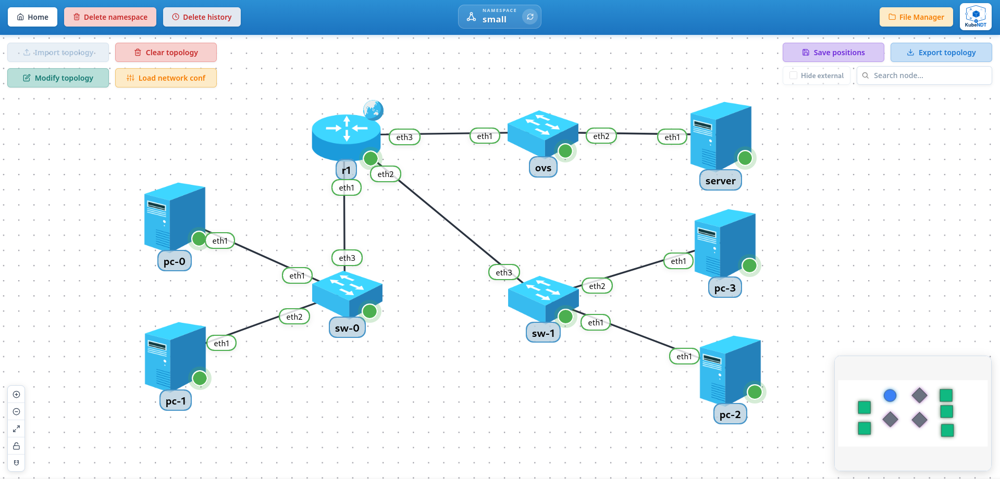

# 1-test-small

Small end-to-end scenario to validate basic KubeNDT workflows:

- Topology import and deployment
- Driver-based network configuration
- Interactive shell
- Mounted files (both ConfigMap-backed and Secret-backed)
- Environment variables configuration in nodes
- L2/L3 connectivity across hosts, switches and routers

## Topology Overview



Nodes deployed:

| Node | Driver | Image | Replicas | Role |
| --- | --- | --- | --- | --- |
| `pc` | `BasicHostDriver` | `alpine:3.24.2` | 4 | Alpine hosts, two per LAN; mount `test.sh` and carry `ENV1`/`ENV2` |
| `server` | `BasicHostDriver` | `alpine:3.24.2` | 1 | Alpine host behind the OVS switch; mounts the Secret-backed `secret.env` |
| `sw` | `LinuxSwitchDriver` | `ubuntu:26.04` | 2 | Linux bridge switches, one per LAN |
| `ovs` | `OpenVSwitchDriver` | `globocom/openvswitch:latest` | 1 | Open vSwitch in front of `server` |
| `r1` | `FRRRouterDriver` | `quay.io/frrouting/frr:10.7.1` | 1 | FRR router joining the three segments, SNAT on `eth0` |

Nodes without a `driver` in the topology JSON get the default of their type: `BasicHostDriver` for hosts and `LinuxSwitchDriver` for switches.

Network segments:

| Segment | Subnet | Purpose |
| --- | --- | --- |
| LAN 1 | `10.0.1.0/24` | `pc-0` (`.11`) and `pc-1` (`.12`) behind `sw-0`; `r1 eth1` (`.1`) is the gateway |
| LAN 2 | `10.0.2.0/24` | `pc-2` (`.11`) and `pc-3` (`.12`) behind `sw-1`; `r1 eth2` (`.1`) is the gateway |
| Server LAN | `10.0.3.0/24` | `server` (`.11`) behind `ovs-0`; `r1 eth3` (`.1`) is the gateway |

## Files In This Folder

- `topology-network-test-small.json`: network inventory and links
- `network_conf.json`: post-deploy actions (default routes, bridge setup, SNAT)
- `files/test.sh`: script mounted into all `pc-*` replicas at `/mnt/test.sh` (ConfigMap-backed)
- `files/secret.env`: demo key/value file mounted into `server-0` at `/etc/kubendt/secret.env`. Marked **sensitive**, so it materialises as a Secret instead of a ConfigMap.

## Notable Characteristics

- `pc-*` replicas include environment variables:
  - `ENV1`
  - `ENV2`
- `pc-*` replicas mount `test.sh` as read-only at `/mnt/test.sh` (ConfigMap-backed)
- `server-0` mounts `secret.env` at `/etc/kubendt/secret.env` (Secret-backed, see step 4 below)
- Links include explicit `uid` values for stable link identity
- Configuration file intentionally uses both reference styles:
  - explicit pod names (`pc-0`, `r1-0`, `sw-0`)
  - single-replica base names (`server`, `ovs`)
- `r1` runs `quay.io/frrouting/frr:10.7.1` through the image's own init (`watchfrr` under `tini`). The startup command installs `iptables`, which `enable_snat` needs and the image does not ship, and enables `ospfd`. The pod is Ready only when zebra and the enabled daemons answer on their vty socket.

## Step-By-Step (UI)

### 1. Create namespace

Create a namespace (e.g. `small` or any name you prefer).

### 2. Open the Namespace File Manager

Go to the Namespace File Manager for that namespace.

### 3. Create `test.sh`

- Create a file named `test.sh` in the namespace files area.
- Copy the content provided in `files/test.sh` and save it:

  ```bash
  #/bin/sh

  echo "My pod is still pending and $ENV1"
  echo "I think I'll just sit here and start $ENV2."
  ```

### 4. Create `secret.env`

- Create a file named `secret.env` in the same namespace files area.
- Copy the content provided in `files/secret.env` and save it:

  ```env
  API_TOKEN=demo-not-a-real-token
  DB_PASSWORD=demo-not-a-real-password
  ```

> The mount declaration in the topology JSON has `"sensitive": true`, so on import the file is automatically marked sensitive and backed by a Kubernetes `Secret`. No manual toggle needed.

### 5. Import topology

- Go back to the namespace graph view.
- Click **Import topology**.
- Select `topology-network-test-small.json`.
- Wait until all nodes are running and visible.
- Nodes can be moved to the preferred position and saved by clicking **Save positions**.

### 6. Apply network configuration

- Click **Load network conf**.
- Select `network_conf.json`.
- Confirm successful actions in the result dialog.

### 7. Validate host defaults and bridges

- Open a shell on `pc-0` and check the route:

  ```bash
  ip route
  ```

  Expected: default route via `10.0.1.1`.

- Open a shell on `server` and check the route:

  ```bash
  ip route
  ```

  Expected: default route via `10.0.3.1`.

- Open a shell on `sw-0`, `sw-1` and `ovs-0` and check the bridges:

  ```bash
  ip link show br0
  ```

  For OVS you can also verify with:

  ```bash
  ovs-vsctl show
  ```

### 8. Validate connectivity

- From `pc-0` to `pc-1` (same subnet):

  ```bash
  ping -c 3 10.0.1.12
  ```

- From `pc-0` to `pc-2` (inter-subnet through `r1`):

  ```bash
  ping -c 3 10.0.2.11
  ```

- From `pc-3` to `server`:

  ```bash
  ping -c 3 10.0.3.11
  ```

### 9. Validate the mounted script and the environment variables

- Open a shell on any `pc-*` and run:

  ```bash
  printenv
  ```

  Expected: values for `ENV1` and `ENV2`.

- Open a shell on any `pc-*` and run:

  ```bash
  sh /mnt/test.sh
  ```

  Expected output includes the values of `ENV1` and `ENV2`.

### 10. Validate the Secret-backed mount on `server-0`

- Open a shell on `server-0` and read the mounted file:

  ```bash
  cat /etc/kubendt/secret.env
  ```

  Expected output:

  ```env
  API_TOKEN=demo-not-a-real-token
  DB_PASSWORD=demo-not-a-real-password
  ```

- From outside the pod, confirm the file is backed by a `Secret` (not a `ConfigMap`). Replace `<namespace>` with the one you created in step 1:

  ```bash
  kubectl get secret    -n <namespace> kubendt-secret-file-secret-env
  kubectl get configmap -n <namespace> kubendt-file-secret-env
  ```

  The first should return an `Opaque` Secret; the second should return `NotFound`.

  To list every mount-backing resource KubeNDT created for the namespace:

  ```bash
  kubectl get cm,secret -n <namespace> -l kubendt/mount-file=true
  ```

### 11. Check the `Files/Vars` tab

Open the info panel of any `pc-*` and go to the last tab, `Files/Vars`. It summarises:

- Defined environment variables
- Mounted files (always read-only). Sensitive files (like `secret.env` on `server-0`) are flagged with a lock icon. Each file can be clicked to show its content in the File Manager.

## Troubleshooting

- If inter-subnet ping fails, verify `r1` has all 3 interfaces up.
- If same-subnet ping fails, verify `br0` exists on `sw-*`/`ovs` and includes the expected interfaces.
- Script `/mnt/test.sh` should be executed with `sh`, as it is mounted with read-only permissions.
- If a target name in `network_conf.json` is ambiguous (multi-replica), use the explicit `-N` pod name.
- If `cat /etc/kubendt/secret.env` on `server-0` is missing, the topology was imported before the file existed. Create it, mark sensitive, then redeploy or restart `server-0`.
