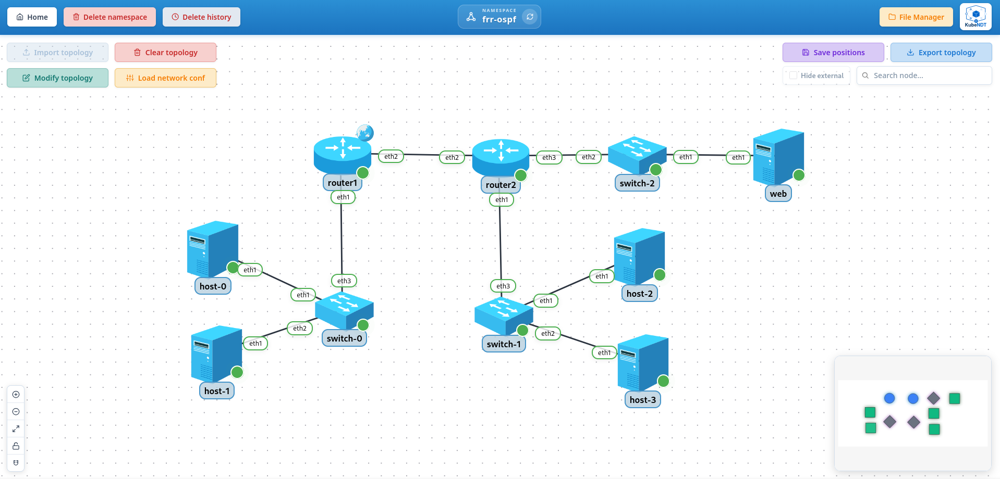

# 2-test-frr-ospf

FRR + OSPF end-to-end scenario to validate dynamic routing workflows in KubeNDT:

- Topology import and deployment
- Driver-based network configuration
- FRR daemon configuration from the UI
- OSPF adjacency between routers
- L3 connectivity across multiple routed subnets

## Topology Overview



This example deploys:

- `host` (4 replicas): `host-0` to `host-3` (Alpine hosts)
- `web` (1 replica): `web` (`nginxdemos/hello` web server)
- `router1` (1 replica): `router1` (FRR router)
- `router2` (1 replica): `router2` (FRR router)
- `switch` (3 replicas): `switch-0` to `switch-2` (Linux switch nodes)

Logical segments:

- `192.168.1.0/24`: `host-0`, `host-1`, and `router1 eth1`
- `10.0.0.0/30`: point-to-point link between `router1 eth2` and `router2 eth2`
- `192.168.2.0/24`: `host-2`, `host-3`, and `router2 eth1`
- `192.168.3.0/24`: `web-0` and `router2 eth3`

## Files In This Folder

- `topology-network-test-frr-ospf.json`: network inventory and links
- `network_conf.json`: post-deploy actions (default routes, bridge setup, SNAT, and OSPF configuration)

## Notable Characteristics

- Both routers use the `FRRRouterDriver`.
- `router1` enables `SNAT` on `eth0`, acting as the upstream edge router. This enables internet access for all devices through the CNI.
- `router2` installs a default route via `10.0.0.1`.
- `switch-*` nodes are configured with Linux bridges using `setup_bridge` actions.
- OSPF is configured declaratively via `ospf_add_network` driver actions in `network_conf.json`

## Step-By-Step (UI)

1. Create namespace
   - Create namespace `frr-ospf` (or any name you prefer).

2. Import topology

   - Go to the namespace graph view.

   - Click `Import topology`.

   - Select `topology-network-test-frr-ospf.json`.

   - Wait until all nodes are running and visible.

3. Apply network configuration (including OSPF)

   - Click `Load network conf`.

   - Select `network_conf.json`.

   - Confirm successful actions in the result dialog. This applies IP config, bridges, SNAT, and OSPF configuration on both routers in one step.

4. Validate OSPF adjacency and learned routes

   - Open a vtysh console on `router1` by selecting the node and clicking the blue shell button, or open a shell and run:

     ```bash
     vtysh -c "show ip ospf neighbor"
     ```

     Expected: neighbor relationship with `router2` in `Full` state.

   - On `router1`, check learned routes:

     ```bash
     vtysh -c "show ip route"
     ```

     Expected OSPF-learned routes for `192.168.2.0/24` and `192.168.3.0/24`.

   - On `router2`, check learned routes:

     ```bash
     vtysh -c "show ip route"
     ```

     Expected OSPF-learned route for `192.168.1.0/24`.

5. Validate end-to-end connectivity

   - From `host-0` to `host-1` (same subnet):

     ```bash
     ping -c 3 192.168.1.52
     ```

   - From `host-0` to `host-2` (across both routers):

     ```bash
     ping -c 3 192.168.2.51
     ```

   - From `host-1` to `web-0`:

     ```bash
     ping -c 3 192.168.3.10
     ```

   - From `host-1`, verify application reachability:

     ```bash
     wget -qO- http://192.168.3.10
     ```

     Expected output from the `nginxdemos/hello` page.

## Troubleshooting

- If `show ip ospf neighbor` is empty, verify both routers have the `ospfd` config applied and that the `10.0.0.0/30` link is up.
- If inter-subnet ping fails, verify `router1` and `router2` learned OSPF routes with `vtysh -c "show ip route"`.
- If same-subnet ping fails, verify `br0` exists on the corresponding `switch-*` node and includes all expected interfaces.
- If `web-0` is unreachable, verify `router2.ospfd.conf` advertises `192.168.3.0/24` and that `web-0` has default route `192.168.3.1`.
- If outbound internet access is required from downstream networks, verify `router1-0` has `SNAT` enabled on `eth0` and `router2` keeps its default route via `10.0.0.1`.
