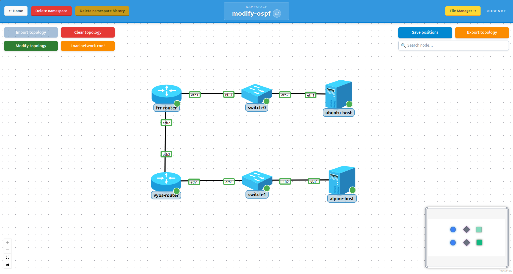
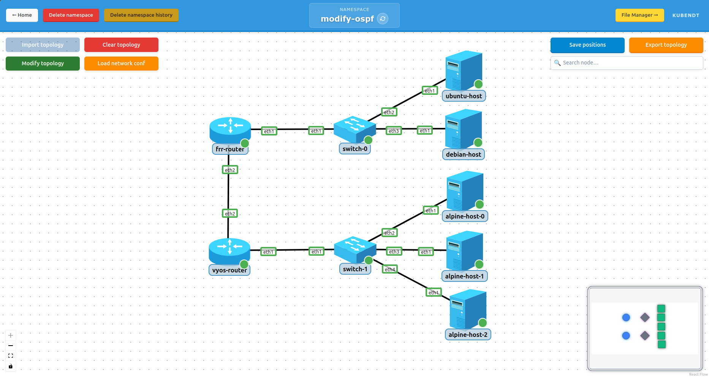

# 3-test-modify-ospf

End-to-end scenario that exercises the full topology lifecycle of KubeNDT on a heterogeneous routed network running OSPF:
- Initial deployment with two routers of **different families**, one container-based FRR router and one VM-based VyOS router (QEMU), forming an OSPF adjacency over a transit link
- Scale-up of a host node from 1 to 3 replicas
- Addition of a new node with its link
- Scale-down back to 1 replica
- Deletion of the added node
- Replay-based recovery after a forced pod restart

This is the reference scenario used in the KubeNDT paper for the dynamic-modification use case. It also demonstrates **driver heterogeneity**: the FRR router and the VyOS router implement the *same* `OSPFCapable` capability interface through two completely different driver implementations (`FRRRouterDriver` via `vtysh`/`kubectl exec`, `VyOSRouterDriver` via SSH configure-mode against the QEMU guest), yet are configured through the identical `ospf_*` action set. See the VyOS driver details in the implementation section of the paper.

## Prerequisites

The VyOS router is a VM-based node and therefore requires a locally built QEMU image. Unlike the container nodes (which pull public images), you must build `localhost/vyos-router:dev` yourself before deploying this scenario. Build instructions are in [`deploy/custom_images/qemu/vyos-router/`](../../custom_images/qemu/vyos-router/README-vyos.md). The worker nodes must expose `/dev/kvm` for hardware-assisted virtualization.

## Topology Overview

*Initial topology after Phase 1:*



*Topology after Phase 2 (scale-up) and Phase 3 (add):*



Initial deployment:

| Node | Driver | Image | Replicas |
|---|---|---|---|
| `ubuntu-host` | `HostDriver` | `ubuntu:20.04` | 1 |
| `alpine-host` | `BasicHostDriver` | `alpine` | 1 |
| `switch` | `OpenVSwitchDriver` | `globocom/openvswitch` | 2 |
| `frr-router` | `FRRRouterDriver` | `frrouting/frr` (container) | 1 |
| `vyos-router` | `VyOSRouterDriver` | `localhost/vyos-router:dev` (QEMU VM) | 1 |

Network segments:

| Segment | Subnet | Purpose |
|---|---|---|
| LAN A | `10.0.1.0/24` | `ubuntu-host` and any host attached to `switch-0`; `frr-router eth1` (`.1`) is the LAN gateway |
| LAN B | `10.0.2.0/24` | `alpine-host` replicas attached to `switch-1`; `vyos-router eth1` (`.1`) is the LAN gateway |
| Transit | `10.0.254.0/30` | Point-to-point link between `frr-router eth2` (`.1`) and `vyos-router eth2` (`.2`); used by OSPF for inter-LAN routing |

The FRR and VyOS routers establish an OSPF adjacency over the transit link and announce their respective LANs into area 0. After convergence, hosts on LAN A and LAN B can reach each other through the routed core. `ospf_mtu_ignore` is applied on the transit interface of both routers so the adjacency forms regardless of any MTU difference between the container and the VM data path.

## Files In This Folder

- `topology-network-test-modify-ospf.json`: initial topology inventory and links.
- `network_conf.json`: initial network configuration. Sets up OVS bridges, announces OSPF networks on both routers, and assigns default routes to the initial hosts.
- `modify-phase2-scaleup.json`: scales `alpine-host` from 1 to 3 replicas and declares the new links for `alpine-host-1` and `alpine-host-2`.
- `network_conf-phase2.json`: post-scale-up configuration. Adds the new interfaces to `switch-1` bridge and sets the default route on the new replicas.
- `modify-phase3-add.json`: adds a new `debian-host` node attached to `switch-0`.
- `network_conf-phase3.json`: post-add configuration. Adds the new interface to `switch-0` bridge and sets the default route on `debian-host-0`.
- `modify-phase4-scaledown.json`: scales `alpine-host` back from 3 to 1 replica.
- `modify-phase5-delete.json`: deletes `debian-host` and its associated link.

## Lifecycle Phases

The scenario is organized as six sequential phases. Each phase has a clear KubeNDT mechanism under test:

| Phase | Action | Mechanism exercised |
|---|---|---|
| 1 | Deploy initial topology + apply `network_conf.json` | Driver/capability dispatch (HostDriver, BasicHostDriver, OpenVSwitchDriver, FRRRouterDriver, VyOSRouterDriver), OSPF capability across container and VM drivers, bridge setup |
| 2 | Apply `modify-phase2-scaleup.json` + `network_conf-phase2.json` | Scale-up of an existing StatefulSet without redeployment, peer-side link upsert, post-scale configuration on new replicas |
| 3 | Apply `modify-phase3-add.json` + `network_conf-phase3.json` | Add phase of dynamic modification (new node + new link) |
| 4 | Apply `modify-phase4-scaledown.json` | Scale-down of an existing StatefulSet, automatic peer cleanup and operation-history pruning |
| 5 | Apply `modify-phase5-delete.json` | Delete phase of dynamic modification |
| 6 | Force `vyos-router-0` (or `frr-router-0`) pod restart | Replay-based recovery: OSPF, IPs and routes restored automatically from per-pod operation history |

## Step-By-Step (UI)

### 1. Create namespace and deploy

- Create a namespace (e.g. `modify-ospf`).
- Open the namespace graph view, click `Import topology`, and select `topology-network-test-modify-ospf.json`.
- Wait until all six pods reach `Running`. The `vyos-router-0` pod reaches `Running` quickly, but the VyOS guest needs additional time to finish booting and apply its boot-time interface configuration; the readiness probe accounts for this.
- Click `Load network conf` and select `network_conf.json`.

### 2. Validate initial deployment and OSPF convergence

Open a shell on `frr-router-0` and inspect the OSPF state:

```bash
vtysh -c "show ip ospf neighbor"
vtysh -c "show ip ospf route"
```

The neighbor table must show `vyos-router` (router-id `10.0.254.2`) in the `Full` state. The OSPF route table must include a route to `10.0.2.0/24` learned via the transit link.

The same can be checked from the VyOS side through its console (operational mode):

```bash
show ip ospf neighbor
show ip route ospf
```

Validate end-to-end reachability between LANs:

```bash
# From ubuntu-host-0
ping -c 3 10.0.2.11
```

### 3. Phase 2: scale-up

- Click `Modify topology` and select `modify-phase2-scaleup.json`. Confirm that `alpine-host-1` and `alpine-host-2` appear in the graph.
- Click `Load network conf` and select `network_conf-phase2.json`. Confirm successful actions in the result dialog.

Validate from `alpine-host-1`:

```bash
ip a show eth1            # should show 10.0.2.12/24
ip route                  # default route via 10.0.2.1
ping -c 3 10.0.1.11       # cross-LAN reachability through OSPF
```

The same validations apply to `alpine-host-2`. Note that scaling hosts on LAN B requires no reconfiguration on either router: `vyos-router` already announces `10.0.2.0/24` into OSPF.

### 4. Phase 3: add new node

- Click `Modify topology` and select `modify-phase3-add.json`. Confirm that `debian-host-0` appears in the graph attached to `switch-0`.
- Click `Load network conf` and select `network_conf-phase3.json`.

Validate from `debian-host-0`:

```bash
ip a show eth1            # should show 10.0.1.12/24
ip route                  # default route via 10.0.1.1
ping -c 3 10.0.2.11       # reachability to LAN B through OSPF
```

### 5. Phase 4: scale-down

- Click `Modify topology` and select `modify-phase4-scaledown.json`. Confirm that `alpine-host-1` and `alpine-host-2` disappear from the graph.
- `alpine-host-0` must remain reachable and operational.

### 6. Phase 5: delete added node

- Click `Modify topology` and select `modify-phase5-delete.json`. Confirm that `debian-host-0` disappears from the graph.

The topology returns to its original 6-pod base deployment (`ubuntu-host-0`, `alpine-host-0`, `switch-0`, `switch-1`, `frr-router-0`, `vyos-router-0`).

### 7. Phase 6: forced pod restart and replay

Force a restart of a router to exercise the replay-based recovery mechanism. Restarting the **VyOS** router is the more demanding case, since the whole guest reboots and KubeNDT replays the recorded actions through the SSH configure-mode executor:

```bash
kubectl delete pod vyos-router-0 -n modify-ospf
```

Wait for the new `vyos-router-0` pod to reach `Running` and for the guest to finish booting. Then verify, from the VyOS console, that the interface addresses and the OSPF configuration were restored automatically from the per-pod operation history:

```bash
# from inside the new vyos-router guest (operational mode)
show interfaces
show ip ospf neighbor      # frr-router must be Full again
```

The same recovery applies to the FRR router (replayed via `kubectl exec`):

```bash
kubectl delete pod frr-router-0 -n modify-ospf
# then, inside the new frr-router-0:
ip a show eth1             # 10.0.1.1/24 must be present
ip a show eth2             # 10.0.254.1/30 must be present
vtysh -c "show ip ospf neighbor"   # vyos-router must be Full again
```

No manual reconfiguration is required in either case. Cross-LAN reachability between hosts on LAN A and LAN B is restored as soon as the OSPF adjacency comes back up.

## Notable Characteristics

- The scenario combines **five different drivers** in a single topology: `HostDriver`, `BasicHostDriver`, `OpenVSwitchDriver`, `FRRRouterDriver`, and the VM-based `VyOSRouterDriver`. Each modify phase exercises capability dispatch through the resolved driver of the target pod.
- The FRR and VyOS routers are configured through the **same** `ospf_*` action set, even though one is a container reached via `kubectl exec` and the other is a QEMU guest reached over SSH. This is the clearest demonstration of the driver/capability separation: a single `OSPFCapable` interface, two driver realizations.
- OSPF networks are announced via the `ospf_add_network` action, dispatched through each router's OSPF capability rather than via raw shell commands.
- The transit link (`10.0.254.0/30`) is announced into OSPF so that the routers learn each other's LAN prefixes dynamically. No static routes are configured between routers.
- Each modify phase that introduces new pods is paired with a small post-modify configuration file (`network_conf-phase2.json`, `network_conf-phase3.json`). The original `network_conf.json` is not re-applied; only the deltas required for the new pods are issued.
- The replay step does not use a dedicated configuration file. It relies entirely on the operation history persisted by KubeNDT during phases 1, 2, and 3.

For a VyOS-focused scenario that exercises the VM driver's full capability surface (SNAT/DNAT, DNS, external/physical uplink, multiple VyOS routers), see [`6-test-vyos`](../6-test-vyos/README.md).

## Troubleshooting

- If `frr-router` and `vyos-router` never reach the `Full` OSPF state, verify that the transit link is up on both ends (`ip a show eth2` on FRR; `show interfaces` on VyOS) and that the `ospf_add_network` actions were applied successfully on both routers. On FRR, `vtysh -c "show running-config"` should show the `network` statements under `router ospf`; on VyOS, `show configuration commands | match ospf`. A common cause of a stuck `ExStart`/`Exchange` state between heterogeneous routers is an MTU mismatch, confirm `ospf_mtu_ignore` was applied on `eth2` of both routers.
- If the VyOS guest does not pick up its interface addresses, check that the boot-time configuration was generated (the entrypoint builds a seed ISO from the topology) and that the pod has `/dev/kvm` access; without KVM the guest may fail to boot or boot too slowly for the readiness probe.
- If a freshly scaled or added host has no default route, confirm that the corresponding `conf-phaseN.json` was applied AFTER the modify request. Operations targeting a pod that does not yet exist are skipped.
- If `alpine-host-1` or `alpine-host-2` does not get an IP on `eth1`, verify that the corresponding link entry exists in `modify-phase2-scaleup.json` and that `switch-1` bridge includes the new interface.
- If after deleting a router pod the OSPF neighbor never returns to `Full`, check the KubeNDT backend logs for replay results. The expected sequence after restart is: IP assignment on `eth1` and `eth2`, then the `ospf_*` actions on both LAN and transit subnets.
