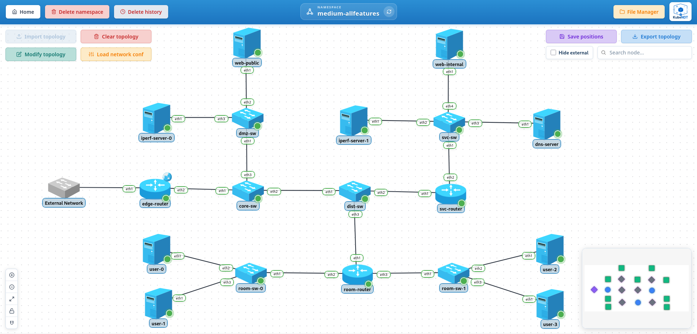

# 4-test-medium-allfeatures

Medium-scale scenario that exercises the most common KubeNDT features together in a single deployment:

- OSPF dynamic routing across three FRR routers
- iperf3 bandwidth testing (internal path and external via DNAT)
- BIND9 DNS server with a custom zone (`kubendt.local`)
- DNS configuration injected into user nodes
- Two nginx web servers (public DMZ and internal service network)
- Mounted config files on DNS server and web server nodes

## Table of Contents

- [Topology Overview](#topology-overview)
- [IP Addressing Summary](#ip-addressing-summary)
- [DNS Zone (`kubendt.local`)](#dns-zone-kubendtlocal)
- [Files In This Folder](#files-in-this-folder)
- [Notable Characteristics](#notable-characteristics)
- [Step-By-Step (UI)](#step-by-step-ui)
- [Apply Traffic Shaping (TC)](#apply-traffic-shaping-tc-and-observe-bandwidth-drop)
- [Troubleshooting](#troubleshooting)

---

## Topology Overview



Nodes deployed:

| Node | Image | Role |
| --- | --- | --- |
| `edge-router-0` | `frrouting/frr` | Edge router, SNAT, DNAT, OSPF |
| `svc-router-0` | `frrouting/frr` | Services router, OSPF |
| `room-router-0` | `frrouting/frr` | User rooms router, OSPF |
| `core-sw-0` | `globocom/openvswitch` | Core switch (OVS) |
| `dist-sw-0` | `globocom/openvswitch` | Distribution switch (OVS) |
| `dmz-sw-0` | `ubuntu` | DMZ switch (Linux bridge) |
| `svc-sw-0` | `ubuntu` | Services switch (Linux bridge) |
| `room-sw-0`, `room-sw-1` | `ubuntu` | Room switches (Linux bridge) |
| `iperf-server-0` | `networkstatic/iperf3` | iperf3 server in DMZ |
| `iperf-server-1` | `networkstatic/iperf3` | iperf3 server in services network |
| `web-public-0` | `nginx:alpine` | Public web server in DMZ |
| `web-internal-0` | `nginx:alpine` | Internal web server in services network |
| `dns-server-0` | `internetsystemsconsortium/bind9:9.18` | BIND9 authoritative DNS |
| `user-0` … `user-3` | `alpine` | End-user hosts |

---

## IP Addressing Summary

| Segment | Subnet | Key hosts |
| --- | --- | --- |
| OSPF backbone / DMZ | `10.0.255.0/24` | `edge-router-0 eth2` `.254`, `svc-router-0 eth1` `.253`, `room-router-0 eth1` `.252`, `web-public-0 eth1` `.20`, `iperf-server-0 eth1` `.10` |
| Services network | `192.168.10.0/24` | `svc-router-0 eth2` `.1`, `iperf-server-1 eth1` `.10`, `dns-server-0 eth1` `.15`, `web-internal-0 eth1` `.20` |
| Room A | `192.168.0.0/24` | `room-router-0 eth2` `.1`, `user-0` `.10`, `user-1` `.11` |
| Room B | `192.168.1.0/24` | `room-router-0 eth3` `.1`, `user-2` `.10`, `user-3` `.11` |
| External uplink | `10.208.x.x/16` | `edge-router-0 eth1` (lab-specific) |

---

## DNS Zone (`kubendt.local`)

`dns-server-0` runs BIND9 with an authoritative zone for `kubendt.local`. Configured records:

| Hostname                     | A record        |
| ---------------------------- | --------------- |
| `ns1.kubendt.local`          | `192.168.10.15` |
| `dns-server.kubendt.local`   | `192.168.10.15` |
| `web-internal.kubendt.local` | `192.168.10.20` |
| `iperf-svc-1.kubendt.local`  | `192.168.10.10` |
| `web-public.kubendt.local`   | `10.0.255.20`   |
| `iperf-dmz-0.kubendt.local`  | `10.0.255.10`   |
| `svc-router.kubendt.local`   | `192.168.10.1`  |
| `room-router0.kubendt.local` | `192.168.0.1`   |
| `room-router1.kubendt.local` | `192.168.1.1`   |

All `user-*` nodes are configured with `add_dns_nameserver 192.168.10.15` and `add_dns_search kubendt.local`, so short names like `web-internal` resolve directly.

---

## Files In This Folder

- `topology-network-test-allfeatures.json`: network inventory and links
- `network_conf.json`: post-deploy actions (IP assignment, default routes, SNAT, DNAT, OSPF, DNS config for user nodes)
- `files/`: ready-to-use content for all files that must exist in the Namespace File Manager before importing the topology

The `files/` directory has this structure:

```
files/
  dns/
    named.conf
    named.conf.options
    named.conf.local
    db.kubendt.local
  web_internal/
    index_internal.html
  web_public/
    index_public.html
```

These files are mounted into the corresponding nodes at deploy time:

| Namespace path | Mounted into | Purpose |
| --- | --- | --- |
| `web_public/index_public.html` | `web-public-0:/usr/share/nginx/html/index.html` | Public web page content |
| `web_internal/index_internal.html` | `web-internal-0:/usr/share/nginx/html/index.html` | Internal web page content |
| `dns/named.conf` | `dns-server-0:/etc/bind/named.conf` | BIND9 main config |
| `dns/named.conf.options` | `dns-server-0:/etc/bind/named.conf.options` | BIND9 options |
| `dns/named.conf.local` | `dns-server-0:/etc/bind/named.conf.local` | Zone declarations |
| `dns/db.kubendt.local` | `dns-server-0:/etc/bind/db.kubendt.local` | Zone data file |

> These files must exist in the Namespace File Manager **before** importing the topology. Missing files will cause the affected nodes to fail to start.

---

## Notable Characteristics

- Three FRR routers (`edge-router-0`, `svc-router-0`, `room-router-0`) form a full OSPF area 0 mesh over the `10.0.255.0/24` backbone. `edge-router-0` originates a default route (`ospf_originate_default`) so all nodes reach the internet via it.
- `edge-router-0 eth1` is the **external uplink**, labeled **"External Network"** in the topology. This interface connects the pod directly to the **host's external network**, the physical underlay that the Kubernetes worker nodes are connected to. The reference lab uses the `10.208.0.0/16` range; the IP and upstream gateway in `network_conf.json` must be adapted to your environment.
- `edge-router-0` has SNAT on `eth1` for internet access and two DNAT rules on `eth1`:
  - TCP/UDP `5201` → `iperf-server-0` (`10.0.255.10:5201`) for external iperf3 tests.
  - TCP `80` → `web-public-0` (`10.0.255.20:80`) for external web access.
- `core-sw-0` and `dist-sw-0` use OVS; `dmz-sw-0`, `svc-sw-0`, `room-sw-*` use a standard Linux bridge (`bridge-utils`).
- `user-*` nodes start with `iproute2-tc` installed (for optional traffic shaping tests).
- `iperf-server-*` nodes auto-start `iperf3 -s -p 5201` on boot. No manual server startup needed.
- DNS is fully functional after applying `network_conf.json`: `user-*` nodes can resolve `web-internal` and `web-public` by short name.

---

## Step-By-Step (UI)

### 1. Create namespace

Create a namespace (e.g. `allfeatures` or any name you prefer).

### 2. Upload files to the Namespace File Manager

Go to the **Namespace File Manager** and create the six files listed in the [Files In This Folder](#files-in-this-folder) section, replicating the folder structure.

The easiest approach is to create each file by hand:

- Click **New folder** to create `dns/`, `web_internal/`, and `web_public/`.
- Inside each folder, click **New file** and paste the content from the corresponding file in the `files/` directory of this example.

Alternatively, if the File Manager supports zip import, you can zip the `files/` directory and upload it directly.

> Files must exist **before** importing the topology because they are mounted at node creation time. Missing files will cause the affected nodes to fail to start.

### 3. Import topology

- Click **Import topology**.
- Select `topology-network-test-allfeatures.json`.
- Wait until all nodes reach `Running` state. The `dns-server-0`, `iperf-server-*`, and `web-*` nodes may take a moment due to their startup commands.
- Optionally arrange and save positions with **Save positions**.

### 4. Edit `network_conf.json` for your environment

- The `replace_ip` action for `edge-router-0 eth1` contains a lab-specific IP (`10.208.11.100/16`). Update it to match your physical network.
- Update the gateway in `set_default_route` for `edge-router-0` if your upstream gateway differs.

### 5. Apply network configuration

- Click **Load network conf** and select `network_conf.json`.
- Confirm all actions succeed. This applies:
  - External IP + SNAT + DNAT on `edge-router-0 eth1`
  - OSPF on all three routers
  - Default routes on `iperf-server-*`, `web-*`, `dns-server-0`, `user-*` nodes
  - DNS resolver (`192.168.10.15`) and search domain (`kubendt.local`) on `user-*` nodes

### 6. Validate OSPF

Open a shell on `edge-router-0` (use the **Shell** action) and run:

```bash
vtysh -c "show ip ospf neighbor"
```

Expected: `svc-router-0` and `room-router-0` both in `Full` state.

Check that the OSPF-learned routes cover all subnets:

```bash
vtysh -c "show ip route"
```

Expected OSPF (`O`) entries for `192.168.0.0/24`, `192.168.1.0/24`, `192.168.10.0/24`.

### 7. Validate web servers

**Internal web server**, from any `user-*` node:

```bash
wget -qO- http://web-internal
```

or with full hostname:

```bash
wget -qO- http://web-internal.kubendt.local
```

Expected: the HTML content from `web_internal/index_internal.html`.

**Public web server**, from any `user-*` node:

```bash
wget -qO- http://web-public.kubendt.local
```

Expected: the HTML content from `web_public/index_public.html`.

### 8. Validate DNS resolution

From any `user-*` node:

```bash
nslookup web-internal
nslookup iperf-svc-1
nslookup web-public
```

All should resolve without specifying the full domain, thanks to the `kubendt.local` search domain.

### 9. Validate iperf3, internal test

`iperf-server-1` is in the services network (`192.168.10.10`) and is reachable from `user-*` nodes via OSPF.

From any `user-*` node, install iperf3 and run:

```bash
apk add iperf3
iperf3 -c iperf-svc-1.kubendt.local -p 5201 -t 5
```

Expected: successful bandwidth test output. Using DNS keeps the command readable.

### 10. Validate iperf3, external DNAT test

`edge-router-0` forwards external TCP/UDP port `5201` to `iperf-server-0` (`10.0.255.10:5201`).

From a machine on the **physical network** (outside the cluster):

```bash
iperf3 -c <edge-router-0-external-ip> -p 5201 -t 5
```

Expected: successful test, traffic forwarded through the DNAT rule on `edge-router-0 eth1`.

To verify the DNAT rules are active, open a shell on `edge-router-0` and check the iptables NAT table:

```bash
iptables -t nat -L PREROUTING -n -v
```

### 11. Validate external web access via DNAT (optional)

From a machine on the physical network:

```bash
curl http://<edge-router-0-external-ip>
```

Expected: the HTML content from `web_public/index_public.html`, forwarded by the DNAT rule TCP 80 → `10.0.255.20:80`.

### 12. Validate internet access (requires external uplink)

From any `user-*` node:

```bash
ping -c 3 8.8.8.8
```

Expected: successful replies routed through `edge-router-0` SNAT.

### 13. Apply traffic shaping (TC) and observe bandwidth drop

The `user-*` nodes have `iproute2-tc` installed and expose the **TCCapable** driver capability, so traffic shaping can be applied directly from the UI without touching the shell.

#### How to apply TC from the Pod Info Panel

1. Click on any `user-*` node in the topology graph to open its **Pod Info Panel**.
2. Switch to the **Links** tab. The tab lists all interfaces of the pod and, for each one, shows a **TC (Qdisc)** section.
3. Select interface `eth1` (the one connected to the room switch).
4. If no qdisc is configured the panel shows `No Qdisc configured (noqueue)`.
   - Choose **tbf** from the _Select Qdisc_ dropdown and click **➕ Create**.
5. Fill in the TBF parameters:
   | Field   | Value    | Meaning                                    |
   | ------- | -------- | ------------------------------------------ |
   | Rate    | `1mbit`  | Maximum bandwidth: 1 Mbit/s                |
   | Burst   | `32kbit` | Token bucket burst size                    |
   | Latency | `50ms`   | Maximum latency before packets are dropped |
6. Click **💾** (Save) to apply. The backend translates this into: `tc qdisc replace dev eth1 root tbf rate 1mbit burst 32kbit latency 50ms`
7. To remove the shaping later, click **🗑️** (Delete).

> The same flow works on any other pod that implements **TCCapable** (FRR routers, OVS switches, Linux switches). Select the appropriate interface for the segment you want to rate-limit.

#### Verify the bandwidth drop with iperf3

Before applying TC, the internal iperf3 test (step 9) reports several hundred Mbit/s inside the cluster. After applying the 1 mbit TBF rule on `user-0 eth1`, re-run the test from the **Shell** of `user-0`:

```bash
iperf3 -c iperf-svc-1.kubendt.local -p 5201 -t 10
```

Expected output (abridged):

```
[ ID] Interval           Transfer     Bitrate
[  5]   0.00-10.00  sec  1.19 MBytes   999 Kbits/sec                  sender
[  5]   0.00-10.00  sec  1.18 MBytes   990 Kbits/sec                  receiver
```

The bitrate is now capped at ≈ 1 Mbit/s instead of the unconstrained value.

To restore full bandwidth, go back to the **Links** tab in the Pod Info Panel and click **🗑️** to delete the qdisc, then re-run iperf3 to confirm the rate returns to normal.

#### Equivalent `network_conf.json` action

If you prefer scripted configuration rather than the UI, the same rule can be expressed as an action in a `network_conf.json` file and applied with **Load network conf**:

```json
{
  "targets": [
    {
      "pod": "user-0",
      "actions": [
        {
          "type": "add_qdisc",
          "iface": "eth1",
          "tcparams": {
            "qdisc": "tbf",
            "rate": "1mbit",
            "burst": "32kbit",
            "latency": "50ms"
          }
        }
      ]
    }
  ]
}
```

To remove it via script, replace `"type": "add_qdisc"` with `"type": "del_qdisc"` (the `tcparams` field is not needed for deletion).

---

## Troubleshooting

- **Node stuck in `Init` / crash loop**: the most common cause is a missing mounted file. Verify all six files from the [Files In This Folder](#files-in-this-folder) table exist in the Namespace File Manager.
- **OSPF neighbors not forming**: verify the `10.0.255.0/24` links are up on all three routers, and that `ospf_mtu_ignore` was applied on the backbone interfaces (the default MTU mismatch between nodes can prevent adjacency).
- **DNS not resolving**: check that `dns-server-0` is in `Running` state and that its zone files were loaded correctly, open a shell on it and run `named-checkzone kubendt.local /etc/bind/db.kubendt.local`. Also confirm `user-*` nodes have `192.168.10.15` in `/etc/resolv.conf` after applying the conf.
- **iperf3 internal test fails**: verify `user-*` nodes can reach `192.168.10.0/24` via ping first. If not, check OSPF routes on `room-router-0` and `svc-router-0`.
- **iperf3 external DNAT fails**: check that the DNAT rule appears in `iptables -t nat -L PREROUTING` on `edge-router-0`. Also confirm `iperf-server-0` has a default route via `10.0.255.254`.
- **`web-internal` returns default nginx page**: the file `web_internal/index_internal.html` may have been created after the node was started. Restart `web-internal-0` to re-mount the file.
- **Internet access not working**: verify `edge-router-0` has the correct external IP on `eth1` and that the SNAT rule is active (`iptables -t nat -L POSTROUTING`).
