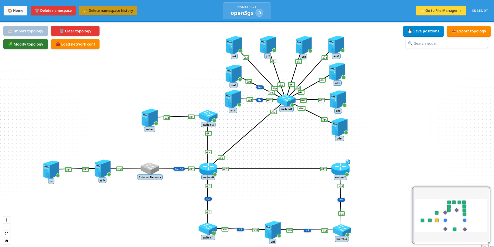

# 5-test-full-open5gs

Full Open5GS 5G Core deployment with a simulated RAN and UE using UERANSIM, validating end-to-end 5G connectivity with KubeNDT:
- All 5GC control-plane network functions (AMF, SMF, NRF, SCP, AUSF, UDM, UDR, PCF)
- User Plane Function (UPF) with TUN interfaces for UE traffic
- MongoDB as the subscriber data store (UDSF node)
- Open5GS Web UI for subscriber management
- UERANSIM gNB (`gnb-0`) connected to the host's external network (labeled "External Network" in the topology), N2/N3 traffic reaches AMF and UPF through the routed core network
- UERANSIM UE (`ue-0`) connected to the gNB via a simulated radio link, establishes a 5G PDU session and routes all traffic through `uesimtun0`
- Multi-segment routed network with internet access via SNAT

## Table of Contents

- [Topology Overview](#topology-overview)
- [IP Addressing Summary](#ip-addressing-summary)
- [Files In This Folder](#files-in-this-folder)
- [Notable Characteristics](#notable-characteristics)
- [Step-By-Step (UI)](#step-by-step-ui)
- [Troubleshooting](#troubleshooting)

---

## Topology Overview



Nodes deployed:

| Node | Image | Role |
|---|---|---|
| `amf-0` | `docker_open5gs:master` | Access and Mobility Management Function |
| `smf-0` | `docker_open5gs:master` | Session Management Function |
| `nrf-0` | `docker_open5gs:master` | Network Repository Function |
| `scp-0` | `docker_open5gs:master` | Service Communication Proxy |
| `ausf-0` | `docker_open5gs:master` | Authentication Server Function |
| `udm-0` | `docker_open5gs:master` | Unified Data Management |
| `udr-0` | `docker_open5gs:master` | Unified Data Repository |
| `pcf-0` | `docker_open5gs:master` | Policy Control Function |
| `udsf-0` | `mongo:6.0` | MongoDB (subscriber data store) |
| `upf-0` | `docker_open5gs:master` | User Plane Function |
| `webui-0` | `docker_open5gs:master` | Open5GS Web UI |
| `gnb-0` | `gradiant/ueransim:3.2.8` | UERANSIM gNB, N2/N3 on host external network, radio link to `ue-0` |
| `ue-0` | `gradiant/ueransim:3.2.8` | UERANSIM UE, connects to gNB, establishes PDU session |
| `switch-0` | `ubuntu` | Control-plane switch (Linux bridge) |
| `switch-1` | `ubuntu` | N4/SMF–UPF switch (Linux bridge) |
| `switch-2` | `ubuntu` | UPF uplink switch (Linux bridge) |
| `switch-3` | `ubuntu` | WebUI switch (Linux bridge) |
| `router-0` | `frrouting/frr` | Edge router, external uplink, WebUI DNAT |
| `router-1` | `frrouting/frr` | Internet gateway router (SNAT) |

Network segments:

| Segment | Subnet | Purpose |
|---|---|---|
| Control plane | `10.5.0.0/24` | All 5GC NFs + MongoDB, gateway `router-0 eth2` (`.1`) |
| N4 / UPF control | `10.5.1.0/24` | SMF–UPF N4 interface, `switch-1`, gateway `router-0 eth3` (`.1`) |
| UPF uplink | `10.5.2.0/24` | UPF `eth2` (`.10`) toward `router-1 eth1` (`.1`), UE data path |
| WebUI | `10.5.3.0/24` | `webui-0` (`.10`), gateway `router-0 eth4` (`.1`) |
| Router interconnect | `10.5.254.0/30` | `router-0 eth5` (`.1`) ↔ `router-1 eth2` (`.2`) |
| External uplink | `10.208.x.x/16` | `router-0 eth1` and `gnb-0 eth1`, **host external network** (the physical underlay the K8s nodes are connected to; labeled "External Network" in the topology, subnet and gateway are environment-specific) |
| Radio (N/A) | `10.6.0.0/24` | `gnb-0 eth2` (`.1`) ↔ `ue-0 eth1` (`.2`), simulated radio link |
| UE internet pool | `192.168.10.0/24` | Allocated by UPF via `ogstun` TUN interface |

---

## IP Addressing Summary

| Node | Interface | IP |
|---|---|---|
| `amf-0` | `eth1` | `10.5.0.10/24` |
| `smf-0` | `eth1` | `10.5.0.11/24` |
| `nrf-0` | `eth1` | `10.5.0.12/24` |
| `scp-0` | `eth1` | `10.5.0.13/24` |
| `ausf-0` | `eth1` | `10.5.0.14/24` |
| `udm-0` | `eth1` | `10.5.0.15/24` |
| `udr-0` | `eth1` | `10.5.0.16/24` |
| `pcf-0` | `eth1` | `10.5.0.17/24` |
| `udsf-0` (MongoDB) | `eth1` | `10.5.0.18/24` |
| `upf-0` | `eth1` (N4) | `10.5.1.10/24` |
| `upf-0` | `eth2` (uplink) | `10.5.2.10/24` |
| `webui-0` | `eth1` | `10.5.3.10/24` |
| `gnb-0` | `eth1` (host external network / N2-N3) | `10.208.11.103/16` (lab-specific) |
| `gnb-0` | `eth2` (radio) | `10.6.0.1/24` |
| `ue-0` | `eth1` (radio) | `10.6.0.2/24` |
| `router-0` | `eth1` (external) | lab-specific (`10.208.x.x/16`) |
| `router-0` | `eth2` | `10.5.0.1/24` |
| `router-0` | `eth3` | `10.5.1.1/24` |
| `router-0` | `eth4` | `10.5.3.1/24` |
| `router-0` | `eth5` | `10.5.254.1/30` |
| `router-1` | `eth1` | `10.5.2.1/24` |
| `router-1` | `eth2` | `10.5.254.2/30` |

---

## Files In This Folder

- `topology-network-test-big.json`: network inventory and links
- `network_conf.json`: post-deploy actions (IP assignment, default routes, SNAT, DNAT, static routes)
- `subscriber_conf.json`: registers the UE subscriber (IMSI, key, OPC, slice/APN) in MongoDB via a `custom` action against `udsf-0`. Applied after `network_conf.json` and before the UE attaches; persisted in the operation history so it is replayed automatically if MongoDB restarts (see [Register a subscriber](#11-register-a-subscriber-in-the-webui)).
- `open5gs_files.zip`: archive with all configuration and init scripts that must be uploaded to the Namespace File Manager before importing the topology

### Contents of `open5gs_files.zip`

When extracted (or imported via the File Manager zip upload), the following structure is created:

```
open5gs_init.sh          ← common init script, mounted into every NF node
ip_utils.py              ← IP helper used by SMF and UPF init scripts
amf/
  amf.yaml
  amf_init.sh
smf/
  smf.yaml
  smf_init.sh
nrf/
  nrf.yaml
  nrf_init.sh
scp/
  scp.yaml
  scp_init.sh
ausf/
  ausf.yaml
  ausf_init.sh
udm/
  udm.yaml
  udm_init.sh
  curve25519-1.key
  secp256r1-2.key
udr/
  udr.yaml
  udr_init.sh
pcf/
  pcf.yaml
  pcf_init.sh
upf/
  upf.yaml
  upf_init.sh
  tun_if.py
webui/
  webui_init.sh
gnb/
  gnb.yaml              ← gNB config template (envsubst variables)
  gnb_init.sh           ← waits for host external network IP on eth1, then starts nr-gnb
ue/
  ue.yaml               ← UE config template (envsubst variables)
  ue_init.sh            ← waits for gNB, starts nr-ue with retry loop
```

Each NF node mounts its own `<nf>.yaml` and `<nf>_init.sh` from the corresponding subfolder, plus `open5gs_init.sh` (and `ip_utils.py` where needed) from the root. All paths referenced in `topology-network-test-big.json` are relative to the namespace file root, so the structure above must be preserved exactly.

---

## Notable Characteristics

- All 5GC network functions use the `ghcr.io/herlesupreeth/docker_open5gs:master` image. Each NF is configured via environment variables (IPs, MCC/MNC, etc.) and its own YAML config file, both provided at deploy time.
- `udsf-0` runs MongoDB and acts as the data store for UDR and PCF. It is named `udsf` to fit the topology naming convention but it is a plain MongoDB instance.
- `udm-0` consumes two keys (`udm/curve25519-1.key`, `udm/secp256r1-2.key`) used by Open5GS to decrypt the SUCI sent by the UE during 5G registration. The topology JSON declares these two mounts with `"sensitive": true`, so they are materialised as `Secret`s instead of `ConfigMap`s. Other Open5GS files stay as ConfigMaps.
- `upf-0` requires the `/dev/net/tun` device to create TUN interfaces (`ogstun` for internet APN, `ogstun2` for IMS APN). The node spec includes a device mount for this.
- `router-1` provides internet access for UE data traffic: it has SNAT enabled on `eth0` (the K8s network interface) and static routes pointing UE subnets toward `upf-0`. UE packets exit via `router-1`'s default K8s route.
- `router-0` and `gnb-0` each have one interface connected to the **host's external network** (labeled "External Network" in the topology). This is the physical underlay network that the Kubernetes worker nodes are connected to, the reference lab uses addresses in the `10.208.0.0/16` range. In your environment the subnet and gateway will differ; the two `replace_ip` entries in `network_conf.json` must be updated accordingly.
- `router-0` additionally exposes the WebUI externally via a DNAT rule: external TCP `9999` is forwarded to `webui-0` (`10.5.3.10:9999`).
- The Open5GS WebUI runs on `webui-0` port `9999`. After deployment it is reachable at `http://<router-0-external-ip>:9999` from the physical network (via the DNAT), or directly at `http://10.5.3.10:9999` from any node on the `10.5.3.0/24` segment.
- Default MCC/MNC is `999/30`, TAC `1`. These values are set as environment variables in the topology file and can be adjusted before importing.

---

## Step-By-Step (UI)

### 1. Create namespace

Create a namespace (e.g. `open5gs` or any name you prefer).

### 2. Upload files to the Namespace File Manager

Go to the **Namespace File Manager** for the namespace.

Use the **Import zip** button and select `open5gs_files.zip`. This will extract the entire directory tree into the namespace file storage, preserving the folder structure described in [Files In This Folder](#files-in-this-folder).

Verify that the root-level files (`open5gs_init.sh`, `ip_utils.py`) and all NF subfolders (`amf/`, `smf/`, `upf/`, etc.) appear in the file list.

> These files must exist **before** importing the topology. They are mounted into nodes at creation time. If any file is missing, the affected node will fail to start.

The UDM keys (`udm/curve25519-1.key`, `udm/secp256r1-2.key`) are declared with `"sensitive": true` in the topology JSON, so on import they are automatically backed by Kubernetes `Secret` resources. After deploy you can verify with:

```bash
kubectl get secret    -n <namespace> kubendt-secret-file-udm-curve25519-1-key
kubectl get secret    -n <namespace> kubendt-secret-file-udm-secp256r1-2-key
kubectl get configmap -n <namespace> kubendt-file-udm-curve25519-1-key
```

The Secret commands should return `Opaque` Secrets; the ConfigMap should return `NotFound`.

### 3. Import topology

- Click **Import topology**.
- Select `topology-network-test-big.json`.
- Wait until all nodes reach `Running` state. NF nodes run multi-step init scripts that take longer than typical containers, allow 30–60 seconds after the pod shows `Running` for the process inside to complete.
- Optionally arrange and save node positions with **Save positions**.

### 4. Edit `network_conf.json` for your environment

Two entries contain lab-specific IPs that must be adjusted before applying:

- `router-0`: `replace_ip` on `eth1` → set the correct IP for `router-0` on the host external network (default: `10.208.11.101/16`).
- `gnb-0`: `replace_ip` on `eth1` → set the correct IP for `gnb-0` on the host external network (default: `10.208.11.103/16`). The `set_default_route` gateway (`10.208.11.101`) must point to `router-0`'s external IP, this is the path N2/N3 traffic uses to reach AMF and UPF.

Also verify the `set_default_route` gateway for `router-0` if your upstream gateway differs from the default.

### 5. Apply network configuration

- Click **Load network conf** and select `network_conf.json`.
- Confirm all actions succeed. This applies:
  - Linux bridges on all four switches
  - External IP on `router-0 eth1`, DNAT TCP 9999 → `webui-0`, default route via physical gateway
  - SNAT on `router-1 eth0`, static routes for 5GC subnets and `192.168.10.0/24`
  - Default routes on all NF nodes toward `router-0`
  - Default route on `upf-0` toward `router-1`, plus static routes back to the control-plane and WebUI subnets
  - Default route on `webui-0` toward `router-0`

### 6. Validate control-plane reachability

Open a shell on `amf-0` and ping other NFs on the control-plane switch:

```bash
ping -c 3 10.5.0.12   # NRF
ping -c 3 10.5.0.18   # MongoDB
```

Open a shell on `smf-0` and ping UPF:

```bash
ping -c 3 10.5.1.10   # UPF N4 interface
```

### 7. Validate UPF TUN interfaces

Open a shell on `upf-0` and check that the TUN interfaces were created by the init script:

```bash
ip link show ogstun
ip link show ogstun2
```

Both should be in `UP` state with an address from `192.168.10.0/24` and `192.168.20.0/24` respectively.

### 8. Validate NF registration via NRF

Open a shell on `nrf-0` and query the NRF REST API to check which NFs have registered:

```bash
curl -s http://10.5.0.12:7777/nnrf-nfm/v1/nf-instances | python3 -m json.tool | grep nfType
```

Expected: entries for `AMF`, `SMF`, `AUSF`, `UDM`, `UDR`, `PCF`, and `UPF`.

Alternatively, open the WebUI (step 9) which shows all registered NFs in the dashboard.

### 9. Access the Open5GS Web UI

The WebUI is reachable in two ways:

**From the physical network** (via DNAT on `router-0`):

```
http://<router-0-external-ip>:9999
```

**From inside the lab** (directly from `webui-0`'s subnet):

```
http://10.5.3.10:9999
```

Default credentials: `admin` / `1423`. Log in and verify the dashboard shows the core as operational. You can also add subscriber entries here (IMSI, key, OPC) in preparation for attaching a UE.

### 10. Validate internet path (requires external uplink)

From a shell on any NF node, test that the default route through `router-0` and back via `router-1` reaches the internet:

```bash
ping -c 3 8.8.8.8
```

Expected: replies routed via `router-0 → router-1 (SNAT) → internet`.

---

## RAN and UE, UERANSIM

### 11. Register a subscriber in the WebUI

Before attaching the UE, the IMSI must be registered in MongoDB. There are two ways to do this:

#### Option A, Automatic via KubeNDT (recommended)

Click **Load network conf** and select `subscriber_conf.json` from this folder.

This uses the `custom` action type to run a `mongosh` command directly in the `udsf-0` (MongoDB) pod. The operation is persisted in history so it is re-applied automatically if the pod restarts.

If you changed `MCC`, `MNC` or `MSISDN` in the topology file, update the IMSI in `subscriber_conf.json` accordingly: `IMSI = MCC + MNC + MSISDN`.

| Field | Value |
|---|---|
| IMSI | `999300000000001` |
| Subscriber Key (Ki) | `465B5CE8B199B49FAA5F0A2EE238A6BC` |
| OPc | `E8ED289DEBA952E4283B54E88E6183CA` |
| APN / DNN | `internet` |
| SST | `1` (no SD) |

#### Option B, Manual via Web UI

Open `http://<router-0-external-ip>:9999` and log in with `admin` / `1423`.

Create a new subscriber with the same values shown in the table above.

If you changed `MCC`, `MNC` or `MSISDN` in the topology file, update the IMSI accordingly: `IMSI = MCC + MNC + MSISDN`.

### 12. gNB and UE startup sequence

After `network_conf.json` is applied:

1. `gnb-0` waits for its external network IP to appear on `eth1` (set by the `replace_ip` action in `network_conf.json`), then starts `nr-gnb`. It establishes the NGAP connection to AMF (`10.5.0.10:38412`) and the GTP-U path to UPF.
2. `ue-0` waits for `gnb-0` (`10.6.0.1`) to respond to ping, then starts `nr-ue`. It performs 5G NAS registration and establishes a PDU session for APN `internet`.
3. Once the PDU session is up, `uesimtun0` appears on `ue-0` with an IP from `192.168.10.0/24`. The init script immediately replaces the default route to use the tunnel.

If the UE cannot register (e.g. subscriber not yet in MongoDB, or gNB not yet connected to AMF), `nr-ue` is killed and restarted automatically every 30s.

To monitor startup:

```bash
kubectl logs -f gnb-0 -n <namespace>
kubectl logs -f ue-0 -n <namespace>
```

Expected final lines in `gnb-0` logs:
```
[sctp] [info] SCTP connection established
[ngap] [info] NG Setup procedure is successful
```

Expected final lines in `ue-0` logs:
```
[ue] PDU session established (uesimtun0 is up)
[ue] Default route -> uesimtun0
```

### 13. Validate 5G end-to-end connectivity

Open a shell on `ue-0`:

```bash
kubectl exec -it ue-0 -n <namespace> -- bash
```

**Check the tunnel interface and routing:**
```bash
ip addr show uesimtun0          # should have an IP from 192.168.10.0/24
ip route                        # default route should point to uesimtun0
```

**Ping by IP (tests GTP-U path through UPF and SNAT on router-1):**
```bash
ping -c 3 8.8.8.8
```

**Ping by name (tests DNS resolution through the tunnel):**
```bash
ping -c 3 google.com
```

**HTTP connectivity:**
```bash
curl -s --max-time 5 https://httpbin.org/ip
```

The returned IP should be the external IP of `router-1` (or your NAT gateway), not the UE's `192.168.10.x` address.

**Confirm traffic exits via the tunnel (not eth0):**
```bash
ping -c 1 -I uesimtun0 8.8.8.8   # explicit interface, must succeed
ping -c 1 -I eth1 8.8.8.8        # direct path, will fail if default route is on uesimtun0
```

---

## Troubleshooting

- **NF node crash-loops or stays in `Init`**: the most common cause is a missing file in the Namespace File Manager. Verify all folders and files from the zip were imported correctly. Check the node logs (KubeNDT shell or `kubectl logs`) for the exact missing path.
- **UPF fails to create TUN interfaces**: `upf-0` requires the `/dev/net/tun` device. Verify the Kubernetes node has TUN capabilities and that the device mount appears in the pod spec. The init script logs will show a permission error if the device is unavailable.
- **NFs not registering with NRF**: check that `nrf-0` is `Running` and reachable at `10.5.0.12` from the other NF nodes. If the NRF came up after other NFs, those NFs may need to be restarted to retry registration.
- **WebUI not accessible externally**: verify the DNAT rule is active on `router-0` with `iptables -t nat -L PREROUTING -n`. Also confirm `router-0` has the correct external IP on `eth1`.
- **SMF cannot reach UPF over N4**: verify `upf-0 eth1` (`10.5.1.10`) is reachable from `smf-0` (`ping 10.5.1.10` from `smf-0`). The N4 link goes through `switch-1`.
- **UE data traffic does not reach internet after attach**: verify `router-1` has static routes for `192.168.10.0/24` via `10.5.2.10` and that SNAT is active on `router-1 eth0`. Also confirm `upf-0` has a default route via `10.5.2.1`.
- **gNB cannot connect to AMF (`NG Setup` never completes)**: verify that `gnb-0 eth1` has its external network IP assigned (`ip addr show eth1` on the pod), that the default route points to `router-0` (e.g. `10.208.11.101`), and that `amf-0` is reachable from `gnb-0` (`ping 10.5.0.10`). AMF must be `Running` and its NGAP port `38412` must be open.
- **UE stuck at `PLMN selection failure` or `PLMN_NOT_ALLOWED`**: the subscriber IMSI is not registered in MongoDB, or the PLMN (MCC/MNC) in the UE config does not match the AMF. Verify the subscriber exists in the WebUI and that `MCC=999`, `MNC=30` match across AMF, gNB, and UE configs.
- **`uesimtun0` never appears on `ue-0`**: the PDU session failed. Check `ue-0` logs for NAS errors. Common causes: SMF cannot reach UPF over N4 (`ping 10.5.1.10` from `smf-0`), or UPF TUN interfaces are not up (`ip link show ogstun` on `upf-0`).
- **DNS resolution fails on `ue-0` after tunnel is up**: verify the default route is set to `uesimtun0` (`ip route` on `ue-0`). If the route is still via `eth1`, the init script may not have run yet, check the logs. You can also manually run `ip route replace default dev uesimtun0` from the pod shell.
