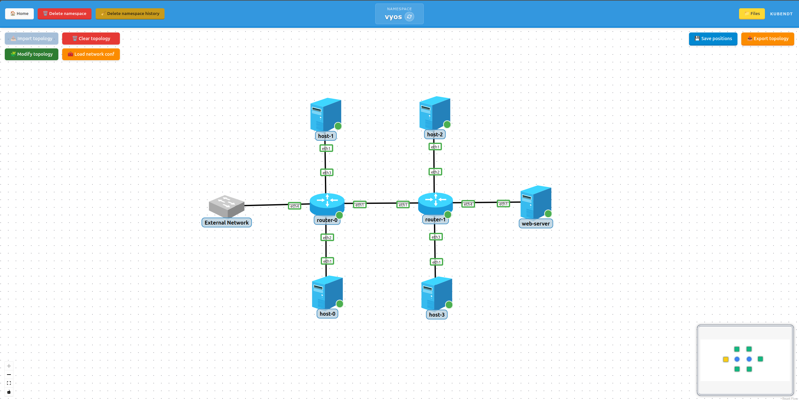

# 6-test-vyos

VyOS + OSPF end-to-end scenario to validate QEMU-based router workflows in KubeNDT:

- Topology import and deployment with QEMU-based nodes
- VyOS router configuration via `VyOSRouterDriver`
- External uplink attachment (physical VLAN)
- OSPF dynamic routing between two VyOS routers
- Static route and SNAT for upstream internet access
- Mounted files on nodes (custom web page)
- L3 connectivity across multiple routed subnets

## Topology Overview



This example deploys:

- `host` (4 replicas): `host-0` to `host-3` (Alpine hosts)
- `web-server` (1 replica): `web-server` (nginx web server)
- `router` (2 replicas): `router-0` and `router-1` (VyOS routers, QEMU-based)

Logical segments:

- `10.0.0.0/24`: `host-0` and `router-0 eth2`
- `10.0.1.0/24`: `host-1` and `router-0 eth3`
- `10.0.10.0/30`: point-to-point link between `router-0 eth1` and `router-1 eth1`
- `10.0.2.0/24`: `host-2` and `router-1 eth2`
- `10.0.3.0/24`: `host-3` and `router-1 eth3`
- `10.0.4.0/24`: `web-server` and `router-1 eth4`
- `router-0 eth4`: external uplink to the **host's external network** (labeled "External Network" in the topology, see Notable Characteristics)

`router-0` acts as the edge router: it holds the SNAT rule on `eth4` and installs a static route toward `10.0.4.0/24` via `router-1`. Both routers run OSPF on area 0.

## Files In This Folder

- `topology-network-test-vyos.json`: network inventory and links
- `network_conf.json`: post-deploy actions (default routes, external IP and SNAT on `router-0`, static route, DNAT, OSPF configuration)
- `files/`: ready-to-use content for the file that must exist in the Namespace File Manager before importing the topology

The `files/` directory has this structure:

```
files/
  web-server/
    index.html
```

It is mounted into the node at deploy time:

| Namespace path | Mounted into | Purpose |
| --- | --- | --- |
| `web-server/index.html` | `web-server:/usr/share/nginx/html/index.html` | Web page served by nginx |

> This file must exist in the Namespace File Manager **before** importing the topology. A missing file makes `web-server` serve the default nginx page instead of your content.

## Notable Characteristics

- Both `router-0` and `router-1` use the `VyOSRouterDriver`, which automatically runs them as full VyOS VMs inside the pod (the driver declares QEMU as its runtime, no extra flag needed).
- Only `router-0` has an external uplink (`eth4`). The link is labeled **"External Network"** in the topology. This refers to the **host's external network** (the physical underlay network that the Kubernetes worker nodes are connected to). In your environment the subnet and gateway will differ. `router-1` is purely internal and has no external uplink.
- `router-0` enables `SNAT` on `eth4`, acting as the upstream edge router for all downstream subnets.
- `router-1` uses `router-0` (`10.0.10.1`) as its default gateway.
- OSPF is configured declaratively via `ospf_*` driver actions in `network_conf.json`.
- `router-0` also configures a DNAT rule on `eth4` that forwards external TCP port 80 to `web-server` (`10.0.4.10:80`), allowing the web server to be reached directly from the physical network.
- `web-server` mounts a custom `index.html` file from the namespace file manager.
- The external IPs assigned to `eth4` in `network_conf.json` are environment-specific and should be adapted to your lab before applying.

## Step-By-Step (UI)

1. Create namespace
   - Create namespace `vyos` (or any name you prefer).

2. Open Namespace File Manager
   - Go to the Namespace File Manager for that namespace.

3. Create `web-server/index.html` file

   - In the file manager, create a folder `web-server/` and, inside it, a file `index.html`.

   - Paste the content from `files/web-server/index.html` in this example (or any HTML you want to serve).

4. Import topology

   - Go back to the namespace graph view.

   - Click `Import topology`.

   - Select `topology-network-test-vyos.json`.

   - Wait until all nodes are running and visible. Note that QEMU-based nodes (`router-0`, `router-1`) take longer to reach `Running` state than regular pods.

   - Nodes can be moved to the preferred position and saved by clicking `Save positions`.

5. Edit `network_conf.json` for your environment

   - The `replace_ip` action for `router-0 eth4` contains a lab-specific IP (`10.208.11.114/16`). Replace it with the address appropriate for your physical network.

   - Similarly, update the `set_default_route` gateway for `router-0` and `add_dns_nameserver` / `add_dns_search` values if needed.

6. Apply network configuration

   - Click `Load network conf`.

   - Select `network_conf.json`.

   - Confirm successful actions in the result dialog. This applies default routes on all hosts, external IP and SNAT on `router-0`, static route, and full OSPF configuration on both routers.

7. Validate OSPF adjacency and learned routes

   - Open a serial shell on `router-0` and run:

     ```bash
     show ip ospf neighbor
     ```

     Expected: neighbor relationship with `router-1` in `Full` state.

   - On `router-0`, check learned routes:

     ```bash
     show ip route
     ```

     Expected OSPF-learned routes for `10.0.2.0/24`, `10.0.3.0/24`, and `10.0.4.0/24`.

   - On `router-1`, check learned routes:

     ```bash
     show ip route
     ```

     Expected OSPF-learned routes for `10.0.0.0/24` and `10.0.1.0/24`.

8. Validate end-to-end connectivity

   - From `host-0` to `host-1` (same router, different subnets):

     ```bash
     ping -c 3 10.0.1.10
     ```

   - From `host-0` to `host-2` (across both routers via OSPF):

     ```bash
     ping -c 3 10.0.2.10
     ```

   - From `host-0` to `web-server`:

     ```bash
     ping -c 3 10.0.4.10
     ```

   - From `host-3`, verify web server reachability:

     ```bash
     wget -qO- http://10.0.4.10
     ```

     Expected: the HTML content of the mounted `index.html`.

9. Validate internet access (if external uplink is configured)

   - From any `host-*`, run:

     ```bash
     ping -c 3 8.8.8.8
     ```

     Expected: successful replies through `router-0` SNAT on `eth4`.

10. Validate DNAT port-forward (if external uplink is configured)

    - From a machine on the physical network, run:

      ```bash
      curl http://<router-0-external-ip>
      ```

      Expected: the HTML content from `web-server`, forwarded by the DNAT rule on `router-0 eth4` (TCP 80 → `10.0.4.10:80`).

    - You can also verify the rule is active from a serial shell on `router-0`:

      ```bash
      show nat destination rules
      ```

## Troubleshooting

- QEMU-based pods boot slower than regular pods. If `router-0` or `router-1` appear `Running` but are not yet reachable via serial shell, wait a few more seconds for the VyOS VM to finish booting.
- If `show ip ospf neighbor` is empty, verify that the `10.0.10.0/30` link is up on both routers and that `ospf_no_passive` was applied on `eth1` on each router.
- If inter-subnet ping fails, verify both routers have OSPF-learned routes with `show ip route`.
- If `web-server` is unreachable, verify `router-1` advertises `10.0.4.0/24` via OSPF and that `web-server` has a default route via `10.0.4.1`.
- If internet access does not work, verify `router-0` has `SNAT` enabled on `eth4` and that the external IP on `eth4` is reachable from the physical gateway.
- If DNAT does not forward traffic, verify the rule appears in `show nat destination rules` on `router-0` and that `router-0` has a static route to `10.0.4.0/24` via `router-1` so it can reach `web-server` after translating.
- If `wget` to `web-server` returns a default nginx page instead of your content, verify the `web-server/index.html` file was created in the namespace file manager before importing the topology.
